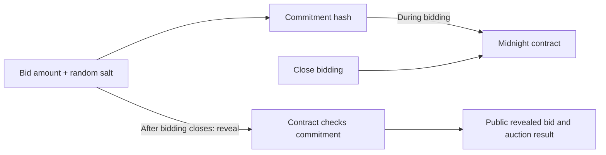

# 🛡️ ProofShield

**A sealed-bid auction dApp on Midnight: bids stay hidden while bidding is open, then are revealed and checked on-chain.**

[](https://github.com/roy-tirtha/proofshild/actions/workflows/ci.yml)

**[Live app](https://proofshild.vercel.app/)** · **[Demo video](https://youtu.be/QQnQySut1N4)** · **[Contract](#deployment)** · **[Quick start](#-quick-start)**

## 🎥 Demo

[](https://youtu.be/QQnQySut1N4)

## ⚡ Overview

In a typical auction, bids are visible as they arrive. That can influence later bidders. ProofShield lets a bidder submit a cryptographic commitment to a bid without putting the amount on-chain during the bidding phase. Once bidding closes, bidders reveal their amounts; Midnight checks each amount and salt against its earlier commitment and records the highest bid that meets the reserve.

The application uses one shared multi-auction Compact contract. Each auction has its own ID and state inside that contract; creating an auction does not deploy another contract.

## 🎯 The problem

Open bids can expose participants' strategies before an auction ends. A sealed-bid process should keep amounts hidden during bidding while still making the eventual result auditable.

## 💡 The approach

ProofShield combines a commit-and-reveal flow with Midnight's Compact smart contract and zero-knowledge proof system. The bidder creates a commitment from the amount and a random salt. The contract records that commitment without receiving the amount. During reveal, the bidder provides the amount and salt, and the contract checks that they reproduce a previously submitted commitment.

Zero-knowledge proofs are used by Midnight to prove that contract calls satisfy the Compact program's rules. In this auction, the amount's bid-phase privacy comes from committing to a hash before revealing; the amount is intentionally made public when revealed. ProofShield does not claim that revealed bids stay private or that it proves external credentials or activity thresholds.

## 🧠 How it works



1. A creator creates an auction with a positive reserve and an owner secret. The contract stores a commitment to that secret for later authorization.
2. Each bidder submits a commitment hash. The amount and salt are kept in encrypted browser storage for the bidder to use when revealing.
3. The creator closes bidding by providing the owner secret. The contract checks it against the stored commitment.
4. Bidders reveal their amount and salt. The contract verifies the matching commitment, publishes the revealed amount, and updates the highest qualifying bid.
5. The creator finalizes the auction. The winning state is readable from the contract.

### Illustrative example

If a bidder commits to `amount = 15` with a random salt, the contract records only the resulting commitment during bidding. After bidding closes, the bidder submits `15` and that salt. The contract checks the commitment and then records the bid amount publicly. The salt makes the commitment difficult to guess before reveal; it is not a promise that the amount remains private after reveal.

## 🔐 Privacy model

| Data | During bidding | After reveal |
| --- | --- | --- |
| Bid amount and random salt | Kept in the bidder's browser; only their commitment is submitted | Amount is submitted to and recorded by the contract; salt is used to verify it |
| Creator secret | Kept in encrypted browser storage; the contract stores its commitment | Provided to authorize close/finalize calls; the secret itself is not written to contract state |
| Auction ID, reserve, phase, counts | Public contract state | Public contract state |
| Revealed bids and leading qualifying bid | Not yet present as revealed amounts | Public contract state |
| Catalogue title, creator wallet, and transaction references | Stored by the application API/database | Public catalogue metadata |

The auction contract enforces the phases and checks commitments. MongoDB Atlas stores catalogue and account-related records, not bid amounts, salts, or creator secrets. Browser encryption does not protect private data if the bidder loses the password or browser storage; retain access to the same wallet and local data to reveal.

## ✨ Implemented

- Five Compact circuits: `create_auction`, `commit_bid`, `close_bidding`, `reveal_bid`, and `finalize_auction`.
- Multiple independent auction IDs managed by one shared contract.
- Commitment verification, positive reserve enforcement, creator authorization, duplicate-commitment protection, and highest qualifying bid selection.
- Browser app flows for creating auctions, placing sealed bids, revealing bids, and viewing/finalizing results.
- Lace and 1AM wallet connection support.
- Auction catalogue and account/auth APIs backed by MongoDB Atlas; Vercel serverless API routes are present alongside the local Express server.
- Local circuit logic tests and a separate network integration test.

## 🧰 Tech stack

| Layer | Technology |
| --- | --- |
| Smart contract and proof circuits | Midnight Compact, Midnight JS |
| Frontend | HTML, CSS, JavaScript, Vite |
| Server and API | Node.js, Express; Vercel serverless routes |
| Authentication and catalogue data | Better Auth, MongoDB Atlas |
| Wallets | Lace, 1AM via Midnight dApp Connector |
| Tests | Vitest, Midnight Testkit |
| Local proof service | Midnight proof server via Docker Compose |
| Package manager | Yarn Classic (1.22.22) |

## 🚀 Quick start

### Requirements

- Node.js 22 or newer
- Yarn 1.22.x
- Compact CLI compatible with language version 0.23 for compiling the contract
- A configured Lace or 1AM wallet on Midnight Preprod to use on-chain actions
- MongoDB Atlas and auth environment variables for sign-in and catalogue/API features
- Docker Compose if running the local proof server

Clone the repository and install dependencies:

```bash
git clone https://github.com/roy-tirtha/proofshild.git
cd proofshild
yarn install
```

Compile the Compact contract and run the frontend build:

```bash
yarn compile
yarn build
```

Run the local Express server, which serves the built frontend and API:

```bash
yarn server
```

Open [http://localhost:3000](http://localhost:3000). For Vite hot reload, use two terminals: run `yarn server` in one and `yarn dev` in the other, then open [http://localhost:5173](http://localhost:5173). Sign-in and catalogue features require the server-side configuration described below.

### Local environment

The auth/API implementation reads configuration from environment variables. For MongoDB-backed auth and catalogue features, configure `MONGODB_URI`, `MONGODB_DB_NAME`, `BETTER_AUTH_URL`, `BETTER_AUTH_SECRET`, `GOOGLE_CLIENT_ID`, and `GOOGLE_CLIENT_SECRET`. Configure Google OAuth origins and callback URLs for the local origin you use. Keep database and OAuth secrets server-side; do not put them in `VITE_*` variables.

The local integration-test network uses local Midnight node, indexer, and proof-server endpoints. Start the proof server with `yarn proof:up` and stop it with `yarn proof:down`; the local node and indexer must also be available. Network-specific integration configuration is in `contract/src/config.ts`.

## 🧪 Testing

Run the local Compact circuit logic suite:

```bash
yarn test
```

The suite contains **6 tests** in `contract/src/test/proofshield-logic.test.ts`. `yarn test` runs this local logic suite; it does not run the network integration test.

To run the integration test, use `yarn test:integration` with the required network services and wallet configuration. Select a supported network with `MIDNIGHT_NETWORK=local`, `preview`, or `preprod`; for non-local networks, configure exactly one corresponding `MIDNIGHT_<NETWORK>_MNEMONIC` or `MIDNIGHT_<NETWORK>_SEED`. The integration test deploys a contract and submits transactions, so network and wallet prerequisites apply. The repository includes one integration scenario in `contract/src/test/proofshield.test.ts`.

GitHub Actions is configured to compile, test, and build on pushes and pull requests.

## 🌐 Deployment

The frontend/API is available at [proofshild.vercel.app](https://proofshild.vercel.app/). The configured shared auction contract is on **Midnight Preprod**:

| Network | Status | Contract address |
| --- | --- | --- |
| Midnight Preprod | Configured shared multi-auction contract | `b0bd1feb64dadad51e987f6ba8e08adaa26945b3135b44c014c8f08a56bbae89` |

The address is configured in [`contract-address.js`](./contract-address.js). Regular users create auction IDs through this contract; they do not deploy per-auction contracts. Maintainer deployment uses `yarn deploy` and requires a funded network wallet plus the matching `MIDNIGHT_PREPROD_MNEMONIC` or `MIDNIGHT_PREPROD_SEED` environment variable.

Vercel builds the static app with `yarn build` and serves the API routes. Configure the server-side auth/database variables above in the deployment environment to enable those features.

## 📁 Project structure

```text
proofshild/
├── api/                 # Vercel API routes
├── assets/              # App illustrations and marks
├── contract/            # Compact source, deployment, providers, and tests
├── server/              # Local Express server and API handlers
├── public/              # Static files and generated contract artifacts
├── *.html, *.js, *.css  # Frontend pages and app logic
├── compose.yml          # Local Midnight proof server
└── package.json         # Scripts and dependencies
```

## 🗺️ Roadmap

No roadmap or planned feature list is currently documented in the repository.

## 📚 Documentation and evidence

- [Compact contract source](./contract/proofshield.compact)
- [Local network configuration](./contract/src/config.ts)
- [Circuit logic tests](./contract/src/test/proofshield-logic.test.ts)
- [Network integration test](./contract/src/test/proofshield.test.ts)
- [Compile output screenshot](./public/yarn_compile.png)
- [Test output screenshot](./public/yarn_test.png)
- [Preprod explorer screenshot](./public/mid_explorer.png)
- [CI workflow screenshot](./public/ci_cd.png)

## 📄 License

No license file is present in this repository.
