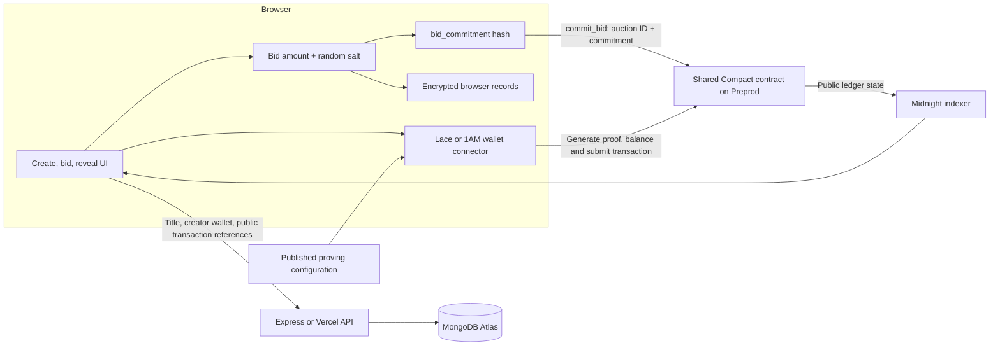
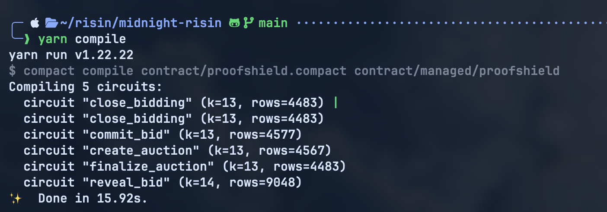
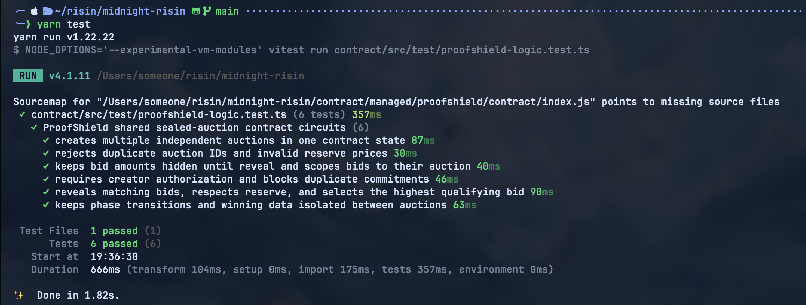
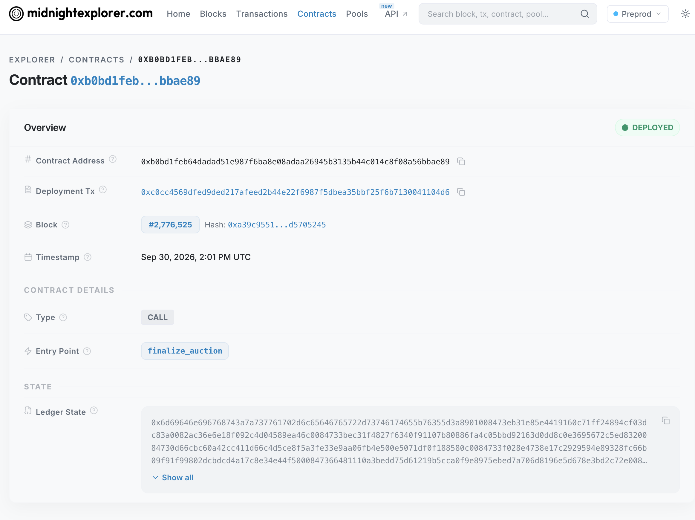
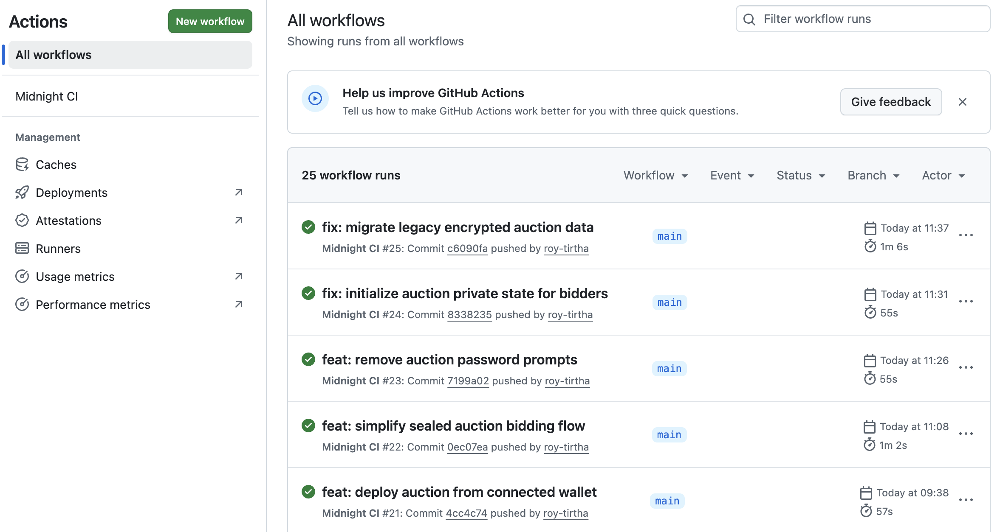

# 🛡️ ProofShield

**A sealed-bid auction dApp on Midnight. Bids are committed privately while bidding is open, then revealed and checked by a shared on-chain contract.**

[](https://github.com/roy-tirtha/proofshild/actions/workflows/ci.yml) · **Midnight Preprod** · [Live app](https://proofshild.vercel.app/)

## 🎥 Demo

[](https://youtu.be/QQnQySut1N4)

**Navigate:** [Overview](#overview) · [How it works](#how-it-works) · [Privacy](#privacy-model) · [Features](#implemented-features) · [Quick start](#quick-start) · [Tests](#testing) · [Deployment](#deployment) · [Evidence](#evidence)

<a id="overview"></a>
## 🛡️ Overview

ProofShield lets a community run an auction without showing bid amounts while bidding is still open. A bidder first submits a commitment: a cryptographic fingerprint made from the bid amount and a random salt. After the creator closes bidding, bidders reveal their bids. The contract checks each reveal against its earlier commitment and tracks the highest revealed bid that meets the reserve.

The app uses Midnight's Compact language to define the smart contract rules. Each auction has a separate ID and state inside **one shared contract**; creating an auction does not deploy a new contract.

### A quick example

Imagine an auction with a reserve of 10. A bidder chooses 15 and a random salt. During bidding, the contract receives the commitment hash, not the amount. After bidding closes, the bidder reveals 15 and the salt. The contract verifies the match and makes the revealed amount part of public auction state.

This is a prototype commit-and-reveal auction. It does not verify a person's skills, credentials, or off-chain activity, and it does not hold or transfer auction funds.

## 🎯 The problem

In an open auction, later bidders can react to earlier visible bids. That can influence bidding strategy and expose what participants are willing to pay. ProofShield separates the bidding and reveal phases so amounts are not submitted to the contract during the bidding phase, while the final qualifying result can still be checked against contract rules.

## 💡 Why Midnight and zero-knowledge proofs?

Midnight is the blockchain network this app targets. Its Compact contract describes state changes and the conditions under which they are valid. For contract calls, Midnight's proof system lets a wallet submit a proof that the call follows those rules; the network verifies the proof and applies the state transition.

In ProofShield, **the sealed-bid behavior comes from commit-and-reveal**: during bidding, the contract receives a hash instead of the amount. The proof system validates contract calls, such as whether a reveal matches a commitment or whether the creator knows the secret used to authorize a transition. Revealing intentionally makes the amount public. This is not a proof about external credentials or an activity-count threshold.

<a id="how-it-works"></a>
## 🧠 How it works



1. **Create:** A signed-in creator connects a Lace or 1AM wallet, chooses a title and positive reserve, and creates an auction ID in the shared Preprod contract. The app stores the creator secret in encrypted browser storage and publishes the title and public transaction reference to the catalogue API.
2. **Commit:** A bidder enters a whole-number amount. The browser generates a random 32-byte salt, calculates `bid_commitment(amount, salt)`, saves the amount and salt locally, and submits only the auction ID and commitment to `commit_bid`.
3. **Close:** The creator submits `close_bidding` with their secret. The contract checks it against the stored owner commitment and moves the auction into the reveal phase.
4. **Reveal:** A bidder submits each saved amount and salt through `reveal_bid`. The contract checks the commitment, records the revealed amount, and updates the highest bid if it meets the reserve.
5. **Finalize:** The creator calls `finalize_auction`. Anyone can read the finalized result from the public contract state.

The browser fetches the compiled contract's proving configuration from the app's static artifact path and asks the connected wallet's Midnight dApp Connector proof provider to prepare transactions. The wallet balances and submits approved transactions. The browser reads contract state through Midnight's Preprod indexer. MongoDB backs the application catalogue, accounts, wallet links, and transaction activity; it is not the source of auction state.

<a id="privacy-model"></a>
## 🔐 Privacy model

| Data | What happens in this implementation |
| --- | --- |
| Private input: bid amount and random salt | Created in the browser and saved in encrypted local storage. During `commit_bid`, only the commitment hash is submitted. During `reveal_bid`, the amount is intentionally disclosed into ledger state; the contract does not store the salt as a ledger field. |
| Private input: `owner_secret` | Used by `create_auction`, `close_bidding`, and `finalize_auction` to calculate/check an owner commitment. The secret itself is not written into the contract ledger; the creator record is stored in this browser. |
| Public inputs/state | Auction ID, reserve, phase, commitment hashes and counts, reveal count, revealed bid amounts, highest qualifying bid, winning commitment, and transaction references. Catalogue title and creator wallet label are stored in MongoDB. |
| What the contract checks | Positive reserve and unique auction ID; phase rules; no duplicate commitment; creator knowledge of the committed secret; reveal matches a submitted, unrevealed commitment; reserve and highest-bid calculation. |
| What a verifier learns | The network verifies that each transaction satisfies the circuit rules and applies the disclosed state changes. During bidding it sees the commitment, not the bid amount. After reveal, the amount and resulting auction state are public. |
| What is not guaranteed | The app cannot recover browser data if it is cleared or lost. The browser derives its encryption key from random material also stored in local storage, so this is not a hardware-backed vault. The contract does not escrow funds, force a bidder to reveal, or verify off-chain facts. |

The privacy boundary is important: commitments conceal amounts during the commit phase when bidders use the app correctly and keep their amounts private. Once an amount is revealed, it is public. A compromised browser or leaked local storage can expose records before then.

<a id="implemented-features"></a>
## ✨ Implemented features

- **Shared auction contract:** Five Compact circuits—`create_auction`, `commit_bid`, `close_bidding`, `reveal_bid`, and `finalize_auction`—manage multiple auction IDs in one contract.
- **Auction rules:** Positive reserves, creator-secret authorization, unique auction IDs and commitments, phase checks, verified reveals, and highest qualifying revealed bid.
- **Browser flows:** Create auctions, browse the MongoDB catalogue with state read from Preprod, seal bids, close bidding, reveal saved bids, and finalize/view results.
- **Wallet support:** Lace and 1AM wallet connection through the Midnight dApp Connector, with wallet approval for transactions.
- **Local private records:** Bid data and creator secrets are encrypted in browser storage and are not sent to the catalogue API.
- **Accounts and catalogue:** Better Auth supports email/password accounts and optional Google OAuth. MongoDB stores account data, wallet links, public auction listings, and transaction references.
- **Proof configuration:** Compiled ZK configuration is copied to the static output for browser use. Browser transactions use the wallet's dApp Connector proof provider; local Node integration tests and deployment use the HTTP proof provider.

### Prototype boundaries

- Auctions target Midnight Preprod; the browser client explicitly requires the wallet to be connected to Preprod.
- Catalogue titles, accounts, linked wallets, and activity history depend on MongoDB configuration. Email/password auth is implemented; Google sign-in requires OAuth credentials.
- Bid and creator records depend on the same browser profile's local storage. Clearing it can make reveals or creator-only actions impossible.
- The contract does not transfer payments, escrow funds, or enforce a time-based deadline. The creator manually closes bidding and can finalize after the reveal phase.
- No credential provider, external activity adapter, standalone verifier portal, or in-app ZK proof inspector is present in the current auction app.

## 🧰 Tech stack

| Area | Technology in this repository |
| --- | --- |
| Smart contract | Midnight Compact (`contract/proofshield.compact`) |
| Midnight client and wallet | Midnight JS, Wallet SDK, dApp Connector API |
| Frontend | Static HTML, CSS, and JavaScript bundled with Vite; React/Vite tooling is installed, but the current pages are not a React application |
| Server/API | Node.js 22+, Express for local development, Vercel serverless routes |
| Data and authentication | MongoDB driver, Better Auth |
| Proof generation | Wallet dApp Connector provider in the browser; HTTP proof provider for Node integration/deployment flows |
| Local proof service | Midnight proof server 8.1.0 in `compose.yml` |
| Tests | Vitest and Midnight Testkit |
| Package manager | Yarn Classic 1.22.22 |

The contract declares Compact `language_version 0.23`; the GitHub Actions workflow installs Compact CLI **0.31.1**. The repository requires Node.js **22 or newer**.

<a id="quick-start"></a>
## 🚀 Quick start

### Requirements

- Node.js 22 or newer and Yarn 1.22.x
- Compact CLI 0.31.1, matching the version configured in GitHub Actions
- A MongoDB Atlas connection string for the local Express server and account/catalogue APIs
- Lace or 1AM wallet on Midnight Preprod for on-chain app actions
- Google OAuth credentials only if you want Google sign-in
- Docker Compose plus a local Midnight node and indexer for the local integration-test network

### Install and configure

```bash
git clone https://github.com/roy-tirtha/proofshild.git
cd proofshild
yarn install --frozen-lockfile
cp .env.example .env
```

Edit `.env` and replace the MongoDB placeholder with a working Atlas URI. Set `MONGODB_DB_NAME` (defaults to `proofshield`) and a random `BETTER_AUTH_SECRET` of at least 32 characters. The server connects to MongoDB during startup, so a valid `MONGODB_URI` is required even for local development. Set `GOOGLE_CLIENT_ID` and `GOOGLE_CLIENT_SECRET` only if enabling Google sign-in; configure its callback as `http://localhost:3000/api/auth/callback/google`.

Compile the contract, then build the frontend:

```bash
yarn compile
yarn build
```

`yarn compile` regenerates the committed `contract/managed/proofshield` compiler artifacts and proving files. `yarn build` bundles the pages and copies those artifacts into the generated `public/contract/managed/` directory.

Start the local Express server:

```bash
yarn server
```

Open [http://localhost:3000](http://localhost:3000). For Vite hot reload, keep `yarn server` running and run `yarn dev` in another terminal; open [http://localhost:5173](http://localhost:5173). Vite forwards `/api` requests to the Express server on port 3000.

### Local proof services

`yarn proof:up` starts the Midnight proof server defined in `compose.yml` on `127.0.0.1:6300`; `yarn proof:down` stops it. The local integration-test network also needs a Midnight node at `127.0.0.1:9944` and indexer at `127.0.0.1:8088`. Network endpoints are defined in [`contract/src/config.ts`](./contract/src/config.ts). The browser app itself targets Preprod and gets proof support from the connected wallet.

<a id="testing"></a>
## 🧪 Testing

Run the contract logic tests:

```bash
yarn test
```

This command runs `contract/src/test/proofshield-logic.test.ts` and currently contains **6 tests**. They exercise multiple auctions in one state, duplicate IDs and reserves, hidden amounts before reveal, creator authorization, commitment validation, reserve/highest-bid selection, and independent auction phases. They run against the Compact runtime in-process; they do not submit transactions to a live network.

The network integration scenario is separate:

```bash
yarn test:integration
```

It deploys a contract and submits create, commit, close, reveal, and finalize transactions. It defaults to the local network and needs the local node, indexer, proof server, and a funded test wallet. For Preprod or Preview, use `yarn test:preprod` or `yarn test:preview` with a funded wallet and exactly one of `MIDNIGHT_PREPROD_MNEMONIC` / `MIDNIGHT_PREPROD_SEED` or `MIDNIGHT_PREVIEW_MNEMONIC` / `MIDNIGHT_PREVIEW_SEED`. The `test:preprod` and `test:preview` scripts run network transactions and may incur network fees.

GitHub Actions runs install, Compact compile, frontend build, and `yarn test` on pushes and pull requests. **No tests or build were run while preparing this README.** The screenshots in [Evidence](#evidence) are historical captures, not a test result for the current commit.

<a id="deployment"></a>
## 🌐 Deployment

The repository configures the browser app for Midnight Preprod and includes this shared contract address in [`contract-address.js`](./contract-address.js):

| Network | Address | Evidence/status |
| --- | --- | --- |
| Midnight Preprod | `b0bd1feb64dadad51e987f6ba8e08adaa26945b3135b44c014c8f08a56bbae89` | Configured in the app; [`public/mid_explorer.png`](./public/mid_explorer.png) captures it as deployed in the Midnight Explorer. The live explorer was not independently re-queried for this README. |

The hosted app URL documented by the repository is [proofshild.vercel.app](https://proofshild.vercel.app/). Vercel is configured to run `yarn install --frozen-lockfile` and `yarn build`, then serve `dist/` and the API routes. The server-side API needs MongoDB and Better Auth environment variables configured in the Vercel project.

Maintainers can deploy a replacement contract with `yarn deploy`. The script compiles the contract and deploys to Preview or Preprod (not `local`) using a funded wallet. Set `MIDNIGHT_NETWORK=preview` or `preprod` and exactly one matching mnemonic or seed in `.env.preview` or `.env.preprod`. Never commit or share those files. A deployment writes a local `deployment.json` and does not automatically update `contract-address.js`; update the app address only after confirming a deployment.

<a id="evidence"></a>
## 📸 Evidence

These are the original evidence images tracked in the repository and referenced in its README history. They show captured runs or state at the time the screenshots were taken; they do not certify the current revision.

### Compact compilation



*Historical `yarn compile` output showing compilation completed for the contract circuits.*

### Contract logic tests



*Historical `yarn test` output reports 6 tests passed. The capture also shows a source-map warning about missing source files.*

### Preprod deployment



*Explorer capture of the configured contract address on Preprod, with a `finalize_auction` entry point and ledger state.*

### GitHub Actions



*Historical workflow list with successful runs on earlier `main` commits; it is not a status report for the current commit.*

These are the four original evidence screenshots found in the current tree and README history. No separate screenshots of the app UI, proof generation, proof verification, or a privacy inspector are present in the repository history. `src/assets/hero.png` is an app asset, not a project-evidence screenshot.

## 📁 Project structure

```text
proofshild/
├── api/                 # Vercel serverless API routes
├── assets/              # ProofShield logo and hero artwork
├── contract/
│   ├── managed/          # Generated Compact bindings, keys, and ZK artifacts
│   ├── src/              # Network providers, wallet setup, and tests
│   └── proofshield.compact
├── public/              # Static assets and compiled browser proof artifacts
├── scripts/             # Build-time artifact copy
├── server/              # Express server, auth, catalogue, and activity handlers
├── *.html, *.js, *.css  # Current browser application
├── compose.yml           # Local proof server
└── package.json          # Scripts and dependencies
```

## 🗺️ Roadmap and project status

No current roadmap for the auction implementation is maintained in the repository. An older README in Git history described a technical-achievement verifier and a multi-level roadmap; that earlier product concept does not match the current auction contract or UI, so those milestones are not presented as current plans here.

## 📚 Further reading

- [Compact contract](./contract/proofshield.compact)
- [Browser transaction and proof-provider integration](./proof-client.js)
- [Network configuration](./contract/src/config.ts)
- [Provider setup for Node tests and deployment](./contract/src/providers.ts)
- [Circuit logic tests](./contract/src/test/proofshield-logic.test.ts)
- [Network integration test](./contract/src/test/proofshield.test.ts)
- [Environment variable template](./.env.example)
- [GitHub Actions workflow](./.github/workflows/ci.yml)

## 📄 License

No `LICENSE` file is present in the repository, so the project does not currently declare a license.
